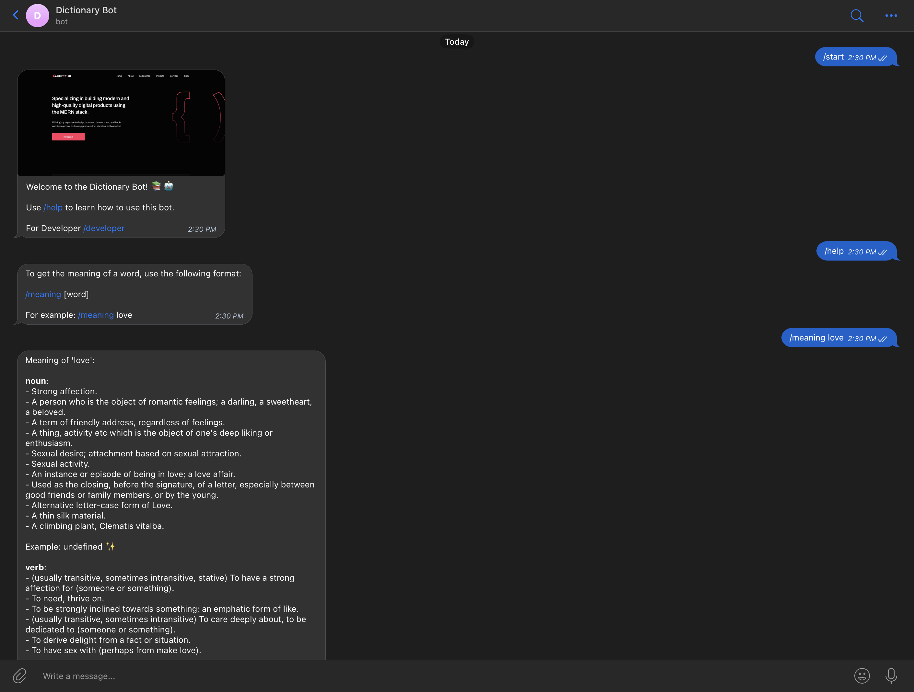

## Telegram Bot Dictionary

This repository contains the code for a Telegram bot that provides word meanings using the Dictionary API. The bot is developed by Harshit Sharma.

## About Me

- **Username:** harshitethic
- **Name:** Harshit Sharma
- **Instagram:** [instagram.com/harshitethic](https://www.instagram.com/harshitethic/)

## Project Description

The Telegram bot is built using Node.js and utilizes the `node-telegram-bot-api` library for interacting with the Telegram Bot API. It also makes use of the `axios` library for making HTTP requests to the Dictionary API.

The bot provides the following commands:

- `/start`: Sends a welcome message along with a preview image.
- `/help`: Provides instructions on how to use the bot.
- `/meaning [word]`: Retrieves the meaning of a word from the Dictionary API.
- `/developer`: Displays information about the developer along with a link to their website.

## Installation

To use the Telegram bot, you need to follow these steps:

1. Clone this repository to your local machine.
2. Install the required dependencies by running `npm install`.
3. Replace `'YOUR_TELEGRAM_BOT_TOKEN'` in the code with your actual Telegram bot token obtained from BotFather.
4. Run the bot using `npm start`.
5. Start a conversation with your bot on Telegram and use the available commands to interact with it.

## Dependencies

The following dependencies are used in this project:

- [node-telegram-bot-api](https://www.npmjs.com/package/node-telegram-bot-api): A library for creating Telegram bots using Node.js.
- [axios](https://www.npmjs.com/package/axios): A library for making HTTP requests from Node.js.

## Contact

If you have any questions or suggestions regarding this project, feel free to reach out to me on Instagram [@harshitethic](https://www.instagram.com/harshitethic/).

Thank you for your interest!
